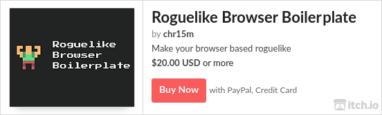
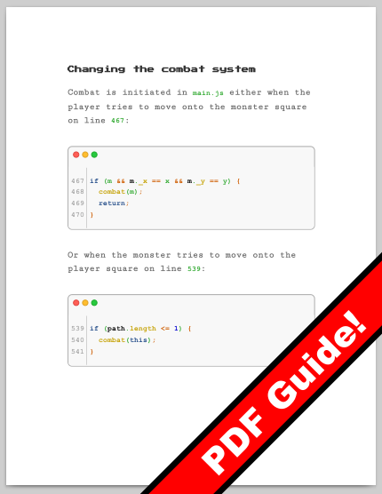

# Hello!

Roguelike Browser Boilerplate helps you get your web based roguelike up and running fast.

The boilerplate takes care of the boring stuff so you can focus on the fun part: making the game.
It includes **level generation, rooms, scenery, item boxes, inventory, an example monster implementation, splash screen, start screen, credits screen, instructions screen, settings screen, menus, pixel styled UI, win/lose condition screens, sound effects, juicy CSS game animations**. It works on **mobile and desktop** with a custom touch-screen interface.

Roguelike Browser Boilerplate is fully open source and MIT licsensed. Yes, that means **you can use it for commercial projects**, no problem.

# Documentation

Check out the [documentation](./Documentation.md) for detailed instructions on how to customise the boilerplate.

# How to support RBB

Buy the [itch.io zip file package of the boilerplate](https://chr15m.itch.io/roguelike-browser-boilerplate):

The [itch.io package](https://chr15m.itch.io/roguelike-browser-boilerplatae) also comes with a nice 47 page PDF guide:

## Contributing

If you improve RBB and you want to contribute your fix or feature just open a PR.
I'll merge clean, modular PRs that fix one thing per commit in a way that is easy to read and test.
Thanks!

# Games made with RBB

[Asterogue, a sci fi roguelike](https://asterogue.space) set in the interior caverns of an asteroid.

[Smallest Quest](https://thepunkcollective.itch.io/smallest-quest) is a simple kid-friendly hand drawn roguelike.

To get your game listed here just send me a PR.

# Roguelike Celebration talk

Building Juicy Minimal Roguelikes in the Browser
https://www.youtube.com/watch?v=dJbUmDsyJRw

