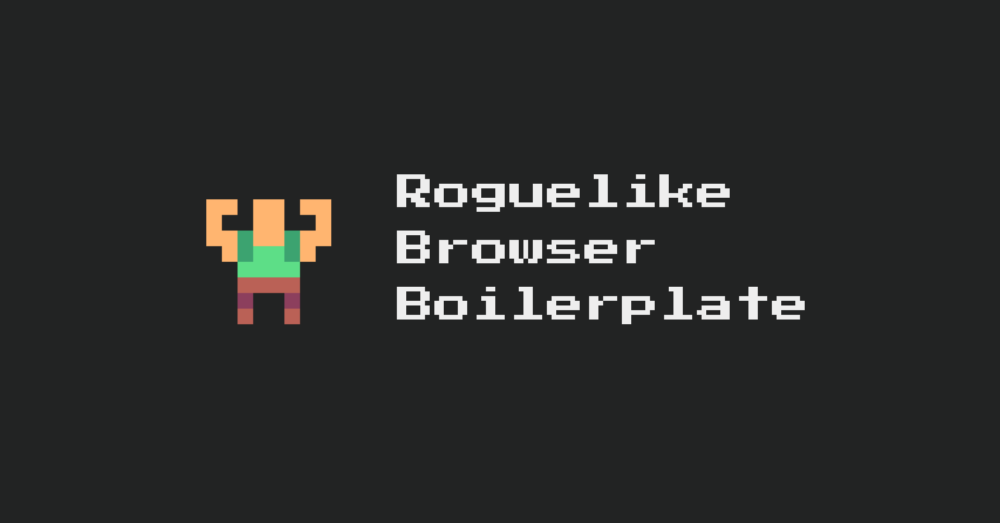
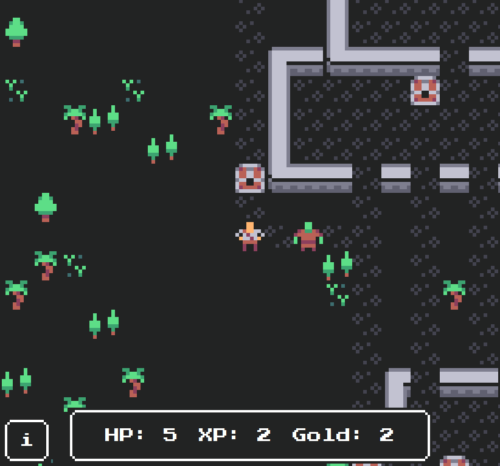
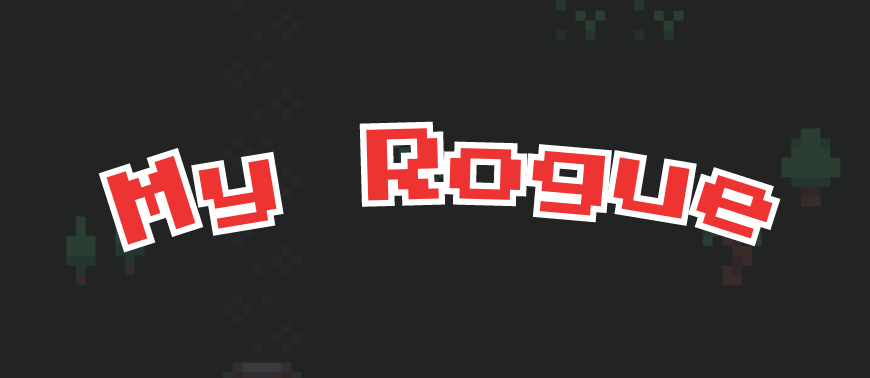
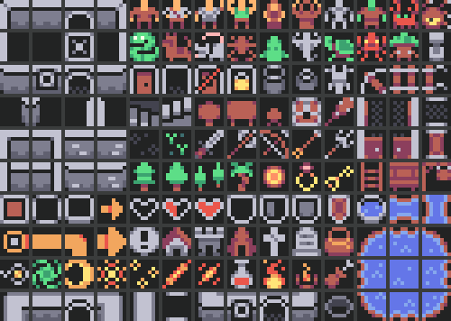
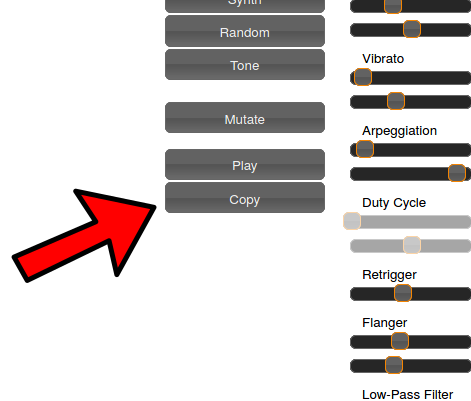

# Hello!

Hello and thanks for purchasing the Roguelike Browser Boilerplate. Are you ready to make your roguelike? Let's get started!

[Roguelike Browser Boilerplate on itch.io >](https://chr15m.itch.io/roguelike-browser-boilerplate)

## Setup

If you're reading this you have already figured out how to unpack the zip file. Congratulations, acheivement unlocked!

The next step is to open `index.html` in your browser. You can do that however you like but the easiest thing is probably just to double-click it.

Once you've done that you're going to want to open `index.html`, `main.js`, and `style.css` in your text editor so you can change the code.

If you don't have a text editor you can use the one at [slingcode.net](https://slingcode.net/), just upload `roguelike-browser-boilerplate.zip` in the app there and you can start editing.

## The Boilerplate

Let's take a look at the files in the boilerplate.

 * `index.html` is the standard web app front page. When you load this in your browser you will see the game start up. There are sections in this HTML file for each of the major screens the user sees: splash screen, title screen and menu, settings screen, credits screen, instructions screen, win and lose screens, and of course the in-game screen with hud, inventory, messages, and play area. You can modify this file to change the different screens.
 * `main.js` is where the actual Javascript game code goes. This is what drives the map generation, player and monster behaviour, and item pickups etc. You can modify this file to change the behaviour of the game itself.
 * `style.css` is a stylesheet specifying how things should be laid out on each screen, colors, fonts, and animations. You can modify this to change the appearance of menus and user interface elements.
 * `colored_tilemap_packed.png` is the tilemap containing both sprites and background tiles used in the boilerplate game. You can modify or replace this to use your own game tiles.
 * `icon.png`, `bg.png`, and `01coin.gif` are graphical assets used for the browser icon of the game, the background image on the first menu, and a rotating coin animation for the win screen.

Take a look around at each of these files to familiarize yourself.
Next up we'll look at changing stuff in these files to make the game look and work the way you want it to.



### Changing the title, icon, and font

The first thing you can do is change the game title. There are two places to change the title.

First there is the title tag at the top of the `index.html` file. This is the standard page title attribute from HTML.

``` {.html .numberLines startFrom="4"}
<title>Roguelike Browser Boilerplate</title>
```

Next there is the title that appears at the start of the game:



You can change the text of this title right at the top of the `main.js`:

``` {.javascript .numberLines startFrom="1"}
// Update this string to set the game title
var gametitle = "My Rogue";
```

If your game has a longer title you might find that some letters disappear off the screen.
You can accommodate a longer title by changing the size of the letters in `style.css`:

``` {.css .numberLines startFrom="150"}
.game-title-text {
  font-size: 64px;
}
```

The title is created with an inline SVG which you can change any way you like, or even replace it with an image. You can find the start of the SVG on line 33 of the `index.html` file:

``` {.xml .numberLines startFrom="33"}
<!-- The game title is set dynamically ... -->
<svg id="game-title" viewBox="0 0 700 250" ...>
```

### Changing the tileset graphics

The default tileset used is the [Micro Rogue tileset from kenney.nl](https://kenney.nl/assets/micro-roguelike). You're welcome to keep using these tiles, or you can tweak them a bit, or you can replace them completely with your own tileset.



To tweak the tiles, load `colored_tilemap_packed.png` up in your favourite pixel editor and just modify the bits you want to change, then save it again. If you reload the game in the browser your changes will take effect immediately.

You can also replace the tiles with a completely different tileset. Just save your new tileset image (a spritesheet with all of the tiles you need on it) in the folder where your game is.

Then to set everything up with your new tileset you'll need to change `main.js` starting at line `14` where you can replace `colored_tilemap_packed.png` with the file name of your new tileset image:

``` {.javascript .numberLines startFrom="14"}
tileSet.src = "YOUR-NEW-IMAGE-FILE-NAME";
```

Next you'll need to tell ROT.js how your tiles are laid out. To do this modify the `tileOptions` data just below that:

``` {.javascript .numberLines startFrom="21"}
var tileOptions = {
  layout: "tile",
  bg: "transparent",
  tileWidth: 8,
  tileHeight: 8,
  tileSet: tileSet,
  tileMap: {
    "@": [40, 0],
    ".": [32, 32],
...
```

The `tileWidth` and `tileHeight` keys specify how many pixels wide and high each of your tiles is. The Micro Rogue tiles are `8 x 8` but if you use a different tileset they may have different dimensions.

Next you will want to modify the `tileMap` to specify how to draw each character. It's a lookup table from the character type to the position in the tilemap for that character's graphic.

For example in the default `tileMap` the player ("@" symbol) is represented by a little dude who is at position `[40,0]` pixels in the `colored_tilemap_packed.png` tilemap.

If you add more character types to your game this is how you specify the corresponding graphic to draw, just create new entries for each character type:

``` {.javascript}
  "X": [80, 40],
```

and then use the `draw()` method to draw them:

``` {.javascript}
  Game.display.draw(x, y, "X");
```

You can find more documentation on the tile options in the [ROT.js documentation for graphical tiles](http://ondras.github.io/rot.js/manual/#tiles). There is a neat tile colorizing technique you can use in there to get more variation.

Finally, if you want to overlay multiple tiles on each other that's easy too.
When you are calling the ROT.js `display.draw()` method, simply pass it an array of characters rather than a single character. For example, to draw the floor tile (`"."`) underneath the player tile (`"@"`) do this:

``` {.javascript}
  Game.display.draw(x, y, [".", "@"]);
```

### Changing the sound effects

All of the sound effects in the boilerplate are generated with `jsfxr`. It is both a library for playing sounds and a user interface for creating sounds. You can find an online version of this at [sfxr.me](https://sfxr.me) and you can make new sound effects there. It's pretty fun to play with.

To change the sound effects in the game, or to add new ones, you're going to want to modify the table on line `56` in `main.js`:

``` {.javascript .numberLines startFrom="21"}
var sfx = {
  "rubber": "5EoyNVaezhPnpFZjpkcJkF8FNCio...
```

The key (e.g. `"rubber"`) is the name that you use to play the sound effect:

``` {.javascript}
  sfx["rubber"].play();
```

The code on the right hand side comes from pressing the "copy" button on the sfxr interface:



So the workflow is to tinker around on [sfxr.me](https://sfxr.me) until you make a sound you want to use. Then click the "Copy" button to copy the sound's code. Then finally paste the code into the `sfx` table on line `21` of `main.js`, either as a new sound (with a unique key) or replacing an existing sound.

After that you can play the sound with `sfx[key].play()`.

If you search the source code for `sfx` or `play` you should find all the places where sounds are played and you can change those too.

### Changing the level generation algorithm

Fog of war, line of sight.

### Changing the player code


### Changing the monster code

The code implementing the monster starts on line `454` of `main.js`:

```{.javascript .numberLines startFrom="454"}
var Monster = function(x, y) {
  this._x = x;
  this._y = y;
  this._draw();
}
```

If you want to store other variables or properties of this particular monster you can put them in here. At the moment the only variables passed in are the `x, y` position, but you could add things like hit points, damage, etc. for implementing combat.

On line `465` of `main.js` you can find the code which controls how the monster behaves on each turn in `Monster.prototype.act`. This function gets called every time the ROT scheduler determines that it is the monster's turn to move.

At the moment what happens is the monster uses the `astar` algorithm to figure out the fastest way to get to where the player is, and takes one step in that direction. There are lots of more interesting behaviours you could implement including field-of-view and distance from the player, interaction between monsters, monsters that can create items, monsters that talk, fast monsters, slow monsters, monsters that freeze the player, monsters that are friendly, etc. etc. The only limit is your imagination.

ROT.js has some great helpers you can use like the [field-of-view](http://ondras.github.io/rot.js/manual/#fov) algorithm. Check out the [interactive documentation](http://ondras.github.io/rot.js/manual/) for more info.

The monster in the boilerplate is added on line `230` of `main.js` and you can modify the code there to add an array of different monsters with different properties when the level starts, rather than just adding a single monster.

### Changing the items code

At the moment the treasure chests are very simply implemented as `"*"` characters on the map. They don't carry any more interesting data than their position. You can make more interesting items by creating a data structure to hold item positions and the properties of the items which are there. A good place to add a new datastructure like that would be in the `Game` code around line `127` in `main.js`.

For example you might have traps which take off varying amounts of HP when the player lands on them, or potions that give the player strength, or food so that players don't starve, or scrolls etc. etc.

You can also implement items which can be collected and added to the player's inventory.

### Using the inventory

At the moment the inventory is an example user interface. To flesh it out you'll want to create an inventory datastructure to hold items that the player picks up. You can make this a new array in the `Game` object around line `127` in `main.js` and when items are added simply add them to the array.

You can use the `$` and `el` methods to re-render the items in the inventory.

### Changing the combat system


### Adding new screens


### Changing the look of the UI

All of the UIs in the game are drawn using basic HTML primitives and styled with the [NES.css] stylesheet. You can blah.

The font used throughout the game is blah blah blah from Google. You can change it by blah.

### Where to find more documentation

 * ROT.js interactive manual
 * ROT.js API
 * [NES.css](https://nostalgic-css.github.io/NES.css/)
 * sfxr.me GitHub page

### Publishing your game

A great place to publish your game is on Itch.

> Pro tip: post frequent updates and screenshots of your progress as you make your game.
> This will increase engagement when it's time to release.

### Bonus: making an app

With a few extra steps, it is possible to distribute your game as a Windows, Mac, iOS, or Android binary.

This is generally a requirement of distributing through channels like Steam.

### Thanks!

If you have feedback or suggestions for improvements to this document or any other part of the project, I would love to hear them. You can share your ideas with me at [chris@mccormick.cx](mailto:chris+rogue@mccormick.cx)!

## Resources

 * [Roguelike Radio podcast](http://www.roguelikeradio.com/)
 * [/r/roguelikedev on Reddit](https://www.reddit.com/r/roguelikedev/)
 * [Roguelike tag on Itch.io]() 
 * [Roguebasin Wiki](http://www.roguebasin.com/index.php?title=Main_Page)
 * [7 Day Roguelike challenge](https://7drl.com/)
 * [BSD Rogue v5.4.4 source code](https://github.com/Davidslv/rogue)

## Credits

 * [ROT.js](https://ondras.github.io/rot.js/hp/) (BSD license)
 * [kenney.nl](https://kenney.nl/assets/micro-roguelike) (CC0 1.0 Universal license)
 * [NES.css](https://nostalgic-css.github.io/NES.css/) (MIT License)
 * [sfxr.me](https://sfxr.me) (Public domain)
 * [Pixel coin image](https://opengameart.org/content/spinning-pixel-coin-0) (CC-BY 3.0 license)

Roguelike Browser Boilerplate is Copyright Chris McCormick 2020.

## License

If you have purchased this boilerplate you're free to use it as the basis of any project, personal or commercial.

There's no need to ask permission before using it.

Giving attribution is not required, but is greatly appreciated! Please include a link to the Itch page.

If a third party wants to use the boilerplate please ask them to purchase a copy.

Thanks you very much & enjoy!
