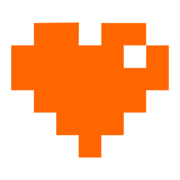

# Hello!

Hello and thanks for purchasing the Roguelike Browser Boilerplate. Are you ready to make your roguelike? Let's get started!

[chr15m.itch.io/roguelike-browser-boilerplate](https://chr15m.itch.io/roguelike-browser-boilerplate)

> © 2020 Chris McCormick
> 
> All rights reserved, including the right to reproduce this document or portions thereof in any form whatsoever. For information, or permission requests, write to the author at <chris+rogue@mccormick.cx>.


## Contents

* [Setup](#setup)
* [The Boilerplate](#the-boilerplate)
    * [Changing the title and icon](#changing-the-title-and-icon)
    * [Changing the look of the UI](#changing-the-look-of-the-ui)
    * [Changing the tileset graphics](#changing-the-tileset-graphics)
    * [Changing the sound effects](#changing-the-sound-effects)
    * [Changing the level generator](#changing-the-level-generator)
    * [Changing the player code](#changing-the-player-code)
    * [Changing the monster code](#changing-the-monster-code)
    * [Changing the items code](#changing-the-items-code)
    * [Using the inventory](#using-the-inventory)
    * [Changing the combat system](#changing-the-combat-system)
    * [Changing or adding new screens](#changing-or-adding-new-screens)
* [Bonus: make an app](#bonus-make-an-app)
* [Publish your game](#publish-your-game)
* [More documentation](#more-documentation)
* [Resources](#resources)
* [Credits](#credits)
* [Thanks](#thanks)

## Setup

If you're reading this you have already figured out how to unpack the zip file. Congratulations, achievement unlocked!

The next step is to open `index.html` in your browser. You can do that however you like but the easiest thing is probably just to double-click it.

Once you've done that you're going to want to open `index.html`, `main.js`, and `style.css` in your text editor so you can change the code.

If you don't have a text editor you can use the one at [slingcode.net](https://slingcode.net/), just upload `roguelike-browser-boilerplate.zip` in the app there and you can start editing.

## The boilerplate

Let's take a look at the files in the boilerplate.

 * `index.html` is the standard web app front page. When you load this in your browser you will see the game start up. There are sections in this HTML file for each of the major screens the user sees: splash screen, title screen and menu, settings screen, credits screen, instructions screen, win and lose screens, and of course the in-game screen with hud, inventory, messages, and play area. You can modify this file to change the different screens.
 * `main.js` is where the actual Javascript game code goes. This is what drives the map generation, player and monster behaviour, and item pickups etc. You can modify this file to change the behaviour of the game itself.
 * `style.css` is a stylesheet specifying how things should be laid out on each screen, colors, fonts, and animations. You can modify this to change the appearance of menus and user interface elements.
 * `colored_tilemap_packed.png` is the tilemap containing both sprites and background tiles used in the boilerplate game. You can modify or replace this to use your own game tiles.
 * `icon.png`, `bg.png`, and `01coin.gif` are graphical assets used for the browser icon of the game, the background image on the first menu, and a rotating coin animation for the win screen.

Take a look around at each of these files to familiarize yourself.
Next up we'll look at changing stuff in these files to make the game look and work the way you want it to.

### Changing the title and icon

The first thing you can do is change the game title. There are two places to change the title.

First there is the title tag at the top of the `index.html` file. This is the standard page title attribute from HTML.

``` {.html .numberLines startFrom="4"}
<title>Roguelike Browser Boilerplate</title>
```

Next there is the title that appears at the start of the game:


You can change the text of this title right at the top of the `main.js`:

``` {.javascript .numberLines startFrom="1"}
// Update this string to set the game title
var gametitle = "My Rogue";
```

If your game has a longer title you might find that some letters disappear off the screen.
You can accommodate a longer title by changing the size of the letters in `style.css`:

``` {.css .numberLines startFrom="150"}
.game-title-text {
  font-size: 64px;
}
```

The title is created with an inline SVG which you can change any way you like, or even replace it with an image. You can find the start of the SVG on line 33 of the `index.html` file:

``` {.xml .numberLines startFrom="33"}
<!-- The game title is set dynamically ... -->
<svg id="game-title" viewBox="0 0 700 250" ...>
```

After modifying the code, refresh the game page in your browser to see the changes.

The icon for your game is defined at the top of `index.html`:

``` {.html .numberLines startFrom="9"}
<link rel="icon" href="icon.png">
```

You can simply replace the file `icon.png` with your own image to change it.

### Changing the look of the UI

All of the UIs in the game are drawn using basic HTML primitives and styled with the [NES.css](https://github.com/nostalgic-css/NES.css) stylesheet. That's what gives the game those pixelly retro styled boxes and buttons. If you want to style it differently you can remove the NES.css style sheet load on line `13` of `index.html`:

``` {.html .numberLines startFrom="13"}
<link href="https://cdn.jsdelivr.net/npm/nes.css@2.3.0/css/nes.min.css"
      rel="stylesheet">
```

You'll probably want to implement your own styles if you do this and you can do that using CSS in `style.css`. You might also want to change the HTML classes used like `nes-container is-rounded is-dark` as they are specific to the NES.css styling.

The default font used in the boilerplate is called "Press Start 2P". The font is loaded at the start of `style.css`:

``` {.css .numberLines startFrom="1" }
@import url('https://fonts.googleapis.com/css2?family=Press+Start+2P');
```

You can change that to any other CSS font stylesheet.

One place to find new fonts is on Google Fonts.

If you link to a different font you'll need to update the CSS to the name of the new font:

``` {.css .numberLines startFrom="13" }
body {
  font-family: 'Press Start 2P', cursive;
```

### Changing the tileset graphics

The default tileset used is the [Micro Rogue tileset from kenney.nl](https://kenney.nl/assets/micro-roguelike). You're welcome to keep using these tiles, or you can tweak them a bit, or you can replace them completely with your own tileset.


To tweak the tiles, load `colored_tilemap_packed.png` up in your favourite pixel editor and just modify the bits you want to change, then save it again. If you reload the game in the browser your changes will take effect immediately.

You can also replace the tiles with a completely different tileset. Just save your new tileset image (a spritesheet with all of the tiles you need on it) in the folder where your game is.

Then to set everything up with your new tileset you'll need to change `main.js` starting at line `14` where you can replace `colored_tilemap_packed.png` with the file name of your new tileset image:

``` {.javascript .numberLines startFrom="14"}
tileSet.src = "YOUR-NEW-IMAGE-FILE-NAME";
```

Next you'll need to tell ROT.js how your tiles are laid out. To do this modify the `tileOptions` data just below that:

``` {.javascript .numberLines startFrom="21"}
var tileOptions = {
  layout: "tile",
  bg: "transparent",
  tileWidth: 8,
  tileHeight: 8,
  tileSet: tileSet,
  tileMap: {
    "@": [40, 0],
    ".": [32, 32],
...
```

The `tileWidth` and `tileHeight` keys specify how many pixels wide and high each of your tiles is. The Micro Rogue tiles are `8 x 8` but if you use a different tileset they may have different dimensions.

Next you will want to modify the `tileMap` to specify how to draw each character. It's a lookup table from the character type to the position in the tilemap for that character's graphic.

For example in the default `tileMap` the player (`"@"` symbol) is represented by a little adventurer who is at position `[40,0]` pixels in the `colored_tilemap_packed.png` tilemap. Try position `[32,0]` instead to use a different adventurer sprite.

If you add more character types to your game this is how you specify the corresponding graphic to draw, just create new entries for each character type:

``` {.javascript}
  "X": [80, 40],
```

and then use the `draw()` method to draw them:

``` {.javascript}
  Game.display.draw(x, y, "X");
```

You can find more documentation on the tile options in the [ROT.js documentation for graphical tiles](http://ondras.github.io/rot.js/manual/#tiles). There is also a neat tile colorizing technique you can use in there to get more variation.

Finally, if you want to overlay multiple tiles on each other that's easy too.
When you are calling the ROT.js `display.draw()` method, simply pass it an array of characters rather than a single character. For example, to draw the floor tile (`"."`) underneath the player tile (`"@"`) do this:

``` {.javascript}
  Game.display.draw(x, y, [".", "@"]);
```

### Changing the sound effects

All of the sound effects in the boilerplate are generated with `jsfxr`. It is both a library for playing sounds and a user interface for creating sounds. You can find an online version of this at [sfxr.me](https://sfxr.me) and you can make new sound effects there. It's pretty fun to play with.

To change the sound effects in the game, or to add new ones, you're going to want to modify the table on line `56` in `main.js`:

``` {.javascript .numberLines startFrom="21"}
var sfx = {
  "rubber": "5EoyNVaezhPnpFZjpkcJkF8FNCio...
```

The key (e.g. `"rubber"`) is the name that you use to play the sound effect:

``` {.javascript}
  sfx["rubber"].play();
```

The code on the right hand side comes from pressing the "copy" button on the [sfxr.me](https://sfxr.me/) interface:


So the workflow is to tinker around on [sfxr.me](https://sfxr.me) until you make a sound you want to use. Then click the "Copy" button to copy the sound's code. Then finally paste the code into the `sfx` table on line `21` of `main.js`, either as a new sound (with a unique key) or replacing an existing sound.

After that you can play the sound with `sfx[key].play()`.

If you search the source code for `sfx` or `play` you should find all the places where sounds are played and you can change those too.

### Changing the level generator

The default level is created using the `_generateMap()` method in the `Game` object on line `192`. The dungeon layout is generated first using ROT's `Digger` implementation:

``` {.javascript .numberLines startFrom="200"}
var digger = new ROT.Map.Digger(
    tileOptions.width,
    tileOptions.height);
```

``` {.javascript .numberLines startFrom="228"}
  digger.create(digCallback.bind(this));
```

There are several excellent dungeon generators in the ROT library including maze, cellular, and dungeon algorithms, and you can find [more info on those in the interactive documentation](http://ondras.github.io/rot.js/manual/#map). Of course you can also write your own dungeon generation algorithm and there are a ton of resources on [RogueBasin](http://www.roguebasin.com/index.php?title=Roguelike_Dev_FAQ#How_are_dungeons_generated.3F) to help you do this. All you need to do is fill the `map` data structure with `x,y` keys pointing to the character that goes at that position.

Next the level generator places 15 items on the map in the `_generateItems()` method. It randomly assigns these to be either pieces of gold or treasure chests. The treasure chests are all empty except for the first one which contains the amulet:

``` {.javascript  .numberLines startFrom="232"}
_generateItems: function(freeCells) {
  for (var i=0; i<15; i++) {
    ...
```

You can modify this method to generate your own more complicated types of items with different properties.

After this the `_generateMap()` level generator adds some background scenery (trees and plants) which is purely for looks and mood, using the `_generateShrubberies()` method. A total of 100 background scenery elements are added like this and you can modify that method on line `283` to add your own scenery elements.

Next the room walls and corners are drawn in `_drawRooms()` and you can customise the way these are drawn too if you need.

Finally the `player` and `monster` objects are created and added to the map. If you want more than one monster in your levels you will need to modify this code to add monsters to an array rather than setting a single value on `self.monster`. You will want to create multiple monster classes with different abilities and properties, and randomly choose between them to make your game more interesting.

If you want to implement a fog of war algorithm, do so in the `_drawWholeMap()` method, only drawing tiles that are within a certain distance of the player. You can use a simple distance calculation to check the distance of the tile from the player's position like this:

``` {.javascript}
  function distance(x1, y1, x2, y2) {
    return Math.sqrt(
      Math.pow(x2 - x1, 2) +
      Math.pow(y2 - y1, 2));
  }
```

Implementing more complex field-of-view lookups is also possible and again the ROT library has functions for this built in. Check [the documentation for FOV](http://ondras.github.io/rot.js/manual/#fov) for more details.

### Changing the player code

There are three main parts to the player code.
First up is the basic definition of the Player's properties starting on line `378` of `main.js`:

``` {.javascript .numberLines startFrom="378"}
var Player = function(x, y) {
  this._x = x;
  this._y = y;
  this.inventory = [
    ["x", "Axe (+5)"],
    ["p", "Potion"]
  ];
  this.stats = {"hp": 10, "xp": 1, "gold": 0};
  this._draw();
}
```

Here you can see the player's position is defined from whatever position is passed in at creation time. There is also an inventory of items the player carries, and some character stats (hit points, experience points, and gold). If you want to build more complex player entities you should start by adding to this datastructure, any extra information which you need to store about the player. At the moment if you add or change a stat it will automatically be rendered in the heads-up-display at the bottom of the screen. See the later section for using the basic inventory implementation.

The next interesting bit of code is what happens when a key press event comes in. This behaviour is defined on line `405` in the `handleEvent()` method. Basically a lookup is done to see which direction corresponds to the key pressed, and then the `moveplayer()` function on line `451` is called with the direction vector. The reason the `moveplayer()` function is broken out is because is also used later in the click/touch even code so that the game is playable with a touch device or mouse. If you want to implement interesting movement mechanics such as drunken walk or freezing, this is the place to do it. This is also the place where you would implement a hunger function, with the hunger increasing every X steps. You'd keep track of the hunger stat in the `Player` class too.

In the `moveplayer()` function we can also see checks for what kind of tile is being stepped on. Only floor tiles and items are allowed to be stepped on in this implementation. If a monster is moved onto then the `combat()` function is initiated. Near the end of this function the "step" sound is played and the `_checkItem()` method is called.

The `_checkItem()` method on line `422` is the final important part of the player code. Three checks are performed against the tile the player has stepped into. If the amulet has been stepped on the `win()` function is called, displaying that win condition UI flow. If the player has picked up gold their stat is incremented and a sound is played. Finally, if the player has stepped on a chest it must be empty because the amulet was checked for already, so a message is shown to the user.

In this implementation the item is used up and replaced with a floor tile on the last line of that function, but you could just as easily do something different. For example if a trap has been discovered then you would draw the trap in the map datastructure at this point.

### Changing the monster code

The code implementing the monster starts on line `454` of `main.js`:

```{.javascript .numberLines startFrom="454"}
var Monster = function(x, y) {
  this._x = x;
  this._y = y;
  this._draw();
}
```

If you want to store other variables or properties of this particular monster you can put them in here. At the moment the only variables passed in are the `x, y` position, but you could add things like hit points, damage, etc. for implementing combat.

On line `465` of `main.js` you can find the code which controls how the monster behaves on each turn in `Monster.prototype.act`. This function gets called every time the ROT scheduler determines that it is the monster's turn to move.

At the moment what happens is the monster uses the `astar` algorithm to figure out the fastest way to get to where the player is, and takes one step in that direction. There are lots of more interesting behaviours you could implement including field-of-view and distance from the player, interaction between monsters, monsters that can create items, monsters that talk, fast monsters, slow monsters, monsters that freeze the player, monsters that are friendly, etc. etc. The only limit is your imagination.

ROT.js has some great helpers you can use like the [field-of-view](http://ondras.github.io/rot.js/manual/#fov) algorithm. Check out the [interactive documentation](http://ondras.github.io/rot.js/manual/) for more info.

The monster in the boilerplate is added on line `230` of `main.js` and you can modify the code there to add an array of different monsters with different properties when the level starts, rather than just adding a single monster.

### Changing the items code

At the moment the treasure chests are very simply implemented as `"*"` characters on the map. They don't carry any more interesting data than their position in the map. You can make more interesting items by creating a data structure to hold item positions and the properties of the items which are there. A good place to add a new datastructure like that would be in the `Game` code around line `127` in `main.js`.

For example you might have traps which take off varying amounts of HP when the player lands on them, or potions that give the player strength, or food so that players don't starve, or scrolls etc. etc. You can also implement items which can be collected and added to the player's inventory.

The code for detecting when the player steps on an item is on line `416` in `main.js` in the `_checkItem()` method. You can add checks for your other types of items in there and take different action. You can use the "gold" item as an example, which simply increments the player's gold stat, shows a message, and plays a sound.

### Using the inventory

The inventory user interface is rendered with the `renderinventory()` function and at the moment by default it is rendering the contents of the `Player` object's `inventory` property. It's a simple data structure indicating what to draw in the inventory list. Each row in the inventory structure is an array with the first element being the tile image lookup character and the second element being the words to print next to the image.

When an inventory item is selected the code in the callback starting on line `154` in `main.js` is called. Customise this to make more complicated inventory item selection behaviours such as weilding weapons, drinking potions, reading scrolls, etc.

Eventually you will probably want to store more complex item data structures in the player's inventory and then you will want to pre-process `player.inventory` before passing it into the `renderinventory()` function in the format it expects (e.g. the tile/words pairs described above).

### Changing the combat system

Combat is initiated in `main.js` either when the player tries to move onto the monster square on line `467`:

``` {.javascript .numberLines .startFrom="467" }
if (m && m._x == x && m._y == y) {
  combat(m);
  return;
}
```

Or when the monster tries to move onto the player square on line `539`:

``` {.javascript .numberLines .startFrom="539" }
if (path.length <= 1) {
  combat(this);
}
```

Both of these events will run the `combat()` function on line `575`. The combat function itself is fairly simple and easy to modify to make it more interesting. At the moment a dice roll is simulated for the player and if they roll above a 3 they take that many HP off the monster's health. Then if the monster is not dead the same happens in reverse with the monster rolling a dice and trying for a number above 3. If the monster HP are depleted completely the monster dies and is taken out of the game. If the player's HP are depleted the `lose()` function is called to initiate the lose condition UI.

Here are some different ways you could build on this to make the combat more interesting:

 * Factor in the weapon the player is weilding.
 * Factor in how many experience points the player has.
 * Factor in the strength of armour the player is wearing.
 * Give the player experience points if they beat the monster.
 * More complex dice and probability systems.
 * Design a more interesting UI to communicate the player's health.
 * Reveal to the player the health of the monster.
 * Add some AI so the monster can run when hurt.
 * Add ranged weapons, throwing, darts, etc.

The [RogueBasin Articles page](http://www.roguebasin.com/index.php?title=Articles) has numerous interesting articles on combat systems in Roguelikes that you can use for inspiration.

### Changing or adding new screens

The non-game screens defined in the HTML code are:

 * Title screen
 * Settings
 * Credits
 * Instructions
 * Win game
 * Lose game

You can modify any of these simply by editing the HTML. If you need additional functionality such as adding clickable toggles in the settings screen then you can add new event bindings at the bottom of `main.js` on line `886` where all of the event bindings happen.

You can add a new screen by cloning one of the existing screens and using the `showscreen()` command to show a particular screen using its `id` like this: `showscreen("title")`. Make sure you give each new screen a unique `id` like this:

``` {.html}
  <div id="myscreen" class="screen modal">
```

## Bonus: make an app

With a few extra steps, it is possible to distribute your game as a Windows, Mac, iOS, and Android binary.
This is a requirement of distributing through channels like Steam and if you want to sell your game on Itch.io.

There are a few different ways to turn your web app into a native binary:

 * If you want to make binaries for mobile platforms like iOS and Android you can use [Apache Cordova](https://cordova.apache.org/). It's a framework for converting web apps to native apps with command line tools. If you know how to use Nodejs you can get an app converted in just a few steps.
 * Similar to Cordova is the [Electron framework](https://www.electronjs.org/), but it works for building desktop apps for OSX, Windows, and Linux. Once again if you are comfortable using Nodejs on the command line this is a good option for creating a native app.
 * Finally, there are now websites which will do the same task without having to use the command line. Simply search for "convert web app to native" in your favourite search engine. Often you can simply input the URL of your web app and they will produce the right kind of artifact for you automatically.

Once you have produced the native binary using one of the tools above you can use it to sell on Steam, Itch.io the App Store, or Google Play.

## Publish your game

> Pro tip: post frequent updates and screenshots of your progress as you make your game.
> This will increase engagement when it's time to release.

A great place to publish your game is on Itch.io, and it's very easy. You can publish your HTML game directly on <itch.io> by going to "upload new project" and then selecting "HTML" in the "Kind of project" selector. If you have take the extra step of building binaries of your game then you can upload them to to stores for sale.

Once you have published you will want to tell people about your game. Some places you can announce your game:

 * Tag your game with #roguelike when you upload it to Itch.io.
 * [reddit.com/r/roguelikedev](https://reddit.com/r/roguelikedev) (please read the rules before posting).
 * The #advertise-releases channel on the Roguelikes Discord channel.
 * On Twitter, tagging your game with #roguelike, #gamedev, and #indiedev.
 * If you have an email list this is one of the best ways to get the word out.

## More documentation

 * The [ROT.js interactive manual](https://ondras.github.io/rot.js/manual/) is an excellent resource for exploring what ROT is capable of.
 * If you need more technical documentation the [ROT.js API](https://ondras.github.io/rot.js/doc/index.html) is also comprehensive.
 * [Documentation for NES.css](https://nostalgic-css.github.io/NES.css/) is available and you can do quite a bit with it.
 * The [sfxr.me GitHub page](https://github.com/chr15m/jsfxr) has documentation on using it should you need it.

## Resources

 * [Roguelike Radio podcast](http://www.roguelikeradio.com/)
 * [/r/roguelikedev on Reddit](https://www.reddit.com/r/roguelikedev/)
 * [Roguelike tag on Itch.io](https://itch.io/games/tag-roguelike) 
 * [Roguebasin Wiki](http://www.roguebasin.com/index.php?title=Main_Page)
 * [7 Day Roguelike challenge](https://7drl.com/)
 * [BSD Rogue v5.4.4 source code](https://github.com/Davidslv/rogue)

## Credits

Roguelike Browser Boilerplate is Copyright Chris McCormick, 2020.

The following third party properties are also bundled or linked with the boilerplate:

 * [ROT.js](https://ondras.github.io/rot.js/hp/) (BSD license)
 * [kenney.nl Micro Rogue tileset](https://kenney.nl/assets/micro-roguelike) (CC0 1.0 Universal license)
 * [NES.css](https://nostalgic-css.github.io/NES.css/) (MIT License)
 * [sfxr.me](https://sfxr.me) (Public domain)
 * [Pixel coin image](https://opengameart.org/content/spinning-pixel-coin-0) (CC-BY 3.0 license)

Please see the attached license PDF for licensing terms.

## Thanks!

Thank you very much for your purchase and best of luck with your games.

If you have feedback or suggestions please do get in touch at [chris+rogue@mccormick.cx](mailto:chris+rogue@mccormick.cx)!

To find out about more games and games tech join the Infinite Lives mailing list:

<https://infinitelives.github.io>


